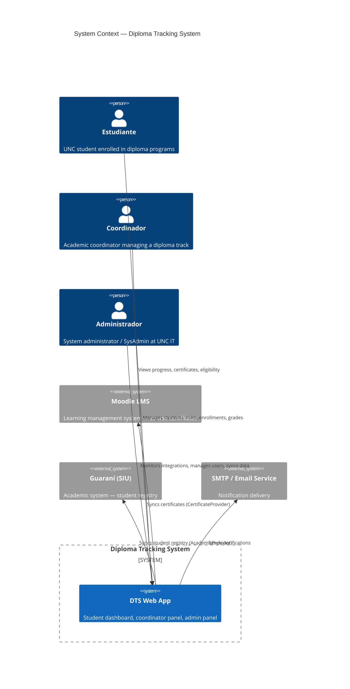
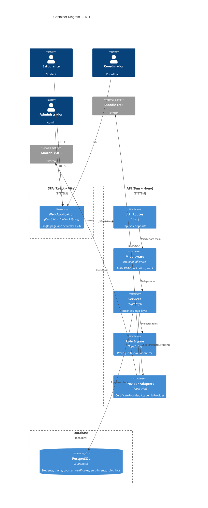

# Architecture Specification — Diploma Tracking System (DTS)

> **Document**: SRS · Architecture Specifications
> **Project**: Diploma Tracking System — Universidad Nacional de Córdoba
> **Version**: 1.0 · **Status**: Initial Draft
> **Language**: English

---

## 1. System Architecture Overview

DTS follows a **monorepo structure** with three main units:

```
diploma-tracking-sys/
├── server/              # Bun + Hono API
│   ├── src/
│   │   ├── routes/      # Hono route handlers (per module)
│   │   ├── middleware/   # Auth, RBAC, validation, error handling
│   │   ├── providers/   # CertificateProvider, AcademicProvider adapters
│   │   ├── engine/      # Rule Engine core
│   │   ├── services/    # Business logic layer
│   │   ├── db/          # Supabase client, migrations, types
│   │   └── types/       # Shared TypeScript types (generated from DB)
│   └── ...
├── client/              # React + Vite + MUI SPA
│   ├── src/
│   │   ├── pages/       # Route pages (dashboard, admin, etc.)
│   │   ├── components/  # Reusable UI components
│   │   ├── hooks/       # Custom hooks + TanStack Query
│   │   ├── stores/      # Zustand stores
│   │   ├── services/    # API client (axios/fetch wrapper)
│   │   ├── i18n/        # Translation files (es-AR, en)
│   │   └── ...
│   └── ...
└── packages/
    └── shared/          # Shared types, validation schemas, constants
```

**Communication pattern**: SPA → REST API (JSON) → Supabase DB / External Providers.

---

## 2. Tech Stack & Rationale

| Layer | Technology | Version | Rationale |
|---|---|---|---|
| Runtime | Bun | ≥1.2 | Native TypeScript execution, built-in test runner, fast package management, compatible with Hono |
| API Framework | Hono | ≥4.0 | Lightweight (< 20KB), typed middleware composition, native Bun support, excellent DX with Zod |
| Frontend | React + Vite | React 19 + Vite 6 | Industry standard, Vite for fast HMR and builds |
| UI Library | MUI | ≥6.0 | Accessible components (WCAG AA compliant), responsive grid, i18n support, theming system |
| State (server) | TanStack React Query | ≥5.0 | Automatic cache invalidation, loading/error states, refetch on window focus, optimistic updates |
| State (client) | Zustand | ≥5.0 | Minimal boilerplate, no providers needed, works outside React tree |
| Database | PostgreSQL (Supabase) | ≥15 | Row-Level Security, type generation, managed hosting, real-time subscriptions |
| Auth | Supabase Auth + jose | — | JWT-based, email/password, refresh token rotation, integrates with RLS |
| Validation | Zod | ≥3.23 | TypeScript-first, type inference, composable schemas, i18n error messages |
| Testing | Vitest | ≥3.0 | Fast, ESM-native, compatible with Bun, built-in coverage |

---

## 3. Key Architectural Decisions

### AD-001: Provider Abstraction via Strategy/Adapter Pattern

All external system integrations (LMS, academic systems) are abstracted behind interfaces. This is the single most important architectural decision — it prevents vendor lock-in and enables multi-LMS support without core changes.

```
┌──────────────────────────────────────────────────────────┐
│                    Business Logic Core                    │
│  (Rule Engine, Dashboard, Enrollment, Exam, Admin Panel) │
└──────────┬────────────────────────────────────┬──────────┘
           │ depends on (interface)             │ depends on (interface)
           ▼                                    ▼
┌──────────────────────┐        ┌──────────────────────────┐
│ CertificateProvider  │        │    AcademicProvider       │
│──────────────────────│        │──────────────────────────│
│ + fetchCertificates()│        │ + fetchStudents()        │
│ + validateCertificate│        │ + fetchStudent(id)       │
└──────────┬───────────┘        └─────────────┬────────────┘
           │ implements                       │ implements
     ┌─────┴──────┐                     ┌─────┴──────┐
     ▼            ▼                     ▼            ▼
┌──────────┐ ┌──────────┐       ┌──────────┐ ┌──────────┐
│  Moodle  │ │  Canvas  │       │ Guaraní  │ │  Custom  │
│ Provider │ │ Provider │       │ Provider │ │ Provider │
└──────────┘ └──────────┘       └──────────┘ └──────────┘
```

**Contract**:
```typescript
interface CertificateProvider {
  fetchCertificates(studentId: string): Promise<Certificate[]>;
  validateCertificate(certificateId: string): Promise<boolean>;
  healthCheck(): Promise<ProviderHealth>;
}

interface AcademicProvider {
  fetchStudents(): Promise<Student[]>;
  fetchStudent(id: string): Promise<Student | null>;
  healthCheck(): Promise<ProviderHealth>;
}
```

**Registration**: Providers are registered in config (`providers.yaml`) and resolved via a service locator at startup. No core code changes needed to add a provider.

### AD-002: Backend-First Types from Supabase Schema

Types are generated from the database schema and serve as the single source of truth:

```
Supabase Schema ──supabase gen types──▶ server/src/types/database.types.ts
                                                    │
                                                    │ re-exported
                                                    ▼
                                          packages/shared/types.ts
                                                    │
                                           ┌───────┴───────┐
                                           ▼               ▼
                                    server/src/      client/src/
```

**Rule**: All domain types originate from the DB schema. API request/response types are composed from DB types using Zod (with Omit/Pick/Partial as needed).

### AD-003: Hono Middleware Composition

API security and cross-cutting concerns use Hono's middleware chain:

```
Request
  │
  ├──▶ authenticate         ── Validates JWT, injects user context
  ├──▶ requireRole(roles[]) ── Checks user role against allowed roles
  ├──▶ validateBody(schema) ── Zod schema validation on request body
  ├──▶ auditLog             ── Logs operation (for CUD endpoints)
  │
  ▼
Route Handler ──▶ Response
```

**Pattern**:
```typescript
router.post(
  '/enrollments',
  authenticate,
  requireRole(['coordinador', 'admin']),
  validateBody(enrollmentSchema),
  auditLog('ENROLLMENT_CREATE'),
  handler,
);
```

### AD-004: Validation with Zod

All API inputs are validated at the middleware layer using Zod schemas. Schemas live in `packages/shared/schemas/` and are shared between server (validation) and client (type inference).

### AD-005: Row-Level Security (Defense in Depth)

Supabase RLS policies enforce data access at the database level as a second layer behind API middleware:

| Role | Student | Coordinator | Admin |
|---|---|---|---|
| Students table | Own record only | Students in assigned tracks | All |
| Certificates | Own only | Students in assigned tracks | All |
| Enrollments | Own only | Students in assigned tracks | All |
| Exam grades | Own only | Students in assigned tracks | All |
| Rules | Read-only (own track) | Read/write (own track) | Read/write (all) |
| Integration config | None | None | Read/write |

### AD-006: Rule Engine — Tree Evaluation

The rule engine evaluates prerequisite rules as a tree structure:

```
Rule: ALL([course_A, course_B, ANY(course_C, course_D)])
                              │
                    ┌─────────┴─────────┐
                    │                   │
                 ALL[ ]              ALL[ ]
                    │                   │
              ┌─────┴─────┐       ┌─────┴─────┐
              ▼           ▼       ▼           ▼
          course_A    course_B  ANY[ ]     (leaf)
                                  │
                            ┌─────┴─────┐
                            ▼           ▼
                        course_C    course_D
```

Evaluation is recursive, depth-first, in-memory. Certificates are fetched once per student and cached for the duration of evaluation. Overrides are checked before certificate conditions.

### AD-007: Monorepo with Sibling Server/Client

```
server/  ←── shares types ──→  client/
   │                              │
   │  packages/shared/            │
   │  (types, schemas,            │
   │   constants)                 │
   └──────────────┬───────────────┘
                  │ npm/workspace
                  ▼
            root package.json
```

No build-time coupling — server and client can be developed and deployed independently. `packages/shared/` is the only shared dependency.

---

## 4. C4 Diagrams

### 4.1 System Context Diagram (C4 Level 1)



### 4.2 Container Diagram (C4 Level 2)



### 4.3 Component Diagram — Rule Engine (C4 Level 3)

```mermaid
C4Component
  title Component Diagram — Rule Engine

  Container_Boundary(engine, "Rule Engine") {
    Component(evaluator, "Evaluator", "TypeScript", "Recursive tree evaluator")
    Component(rule_repo, "RuleRepository", "TypeScript", "Loads rules from DB")
    Component(cert_checker, "CertificateChecker", "TypeScript", "Checks student certificates")
    Component(override_checker, "OverrideChecker", "TypeScript", "Checks active overrides")
    Component(result_builder, "ResultBuilder", "TypeScript", "Builds detailed evaluation result")
  }

  Rel(evaluator, rule_repo, "Loads rules")
  Rel(evaluator, cert_checker, "Checks certificates")
  Rel(evaluator, override_checker, "Checks overrides")
  Rel(evaluator, result_builder, "Builds result")
  Rel(rule_repo, postgres, "SELECT prerequisite_rules")
  Rel(cert_checker, postgres, "SELECT certificates")
  Rel(override_checker, postgres, "SELECT manual_overrides")
```

---

## 5. Data Model

### 5.1 Entity-Relationship Diagram

```mermaid
erDiagram
  tracks ||--o{ courses : contains
  tracks ||--o{ enrollments : has
  tracks ||--o{ prerequisite_rules : configures
  tracks ||--o{ track_coordinators : assigns

  students ||--o{ enrollments : enrolls
  students ||--o{ certificates : earns
  students ||--o{ manual_overrides : targeted_by

  courses ||--o{ certificates : certifies
  courses ||--o{ prerequisite_sources : referenced_as

  prerequisite_rules ||--o{ prerequisite_sources : aggregates

  enrollments ||--o{ exams : participates

  prerequisite_rules ||--o{ manual_overrides : overridden_by

  integrations { }--o{ integration_logs : logs
```

### 5.2 Entity Descriptions

#### `students`

| Column | Type | Description |
|---|---|---|
| id | UUID PK | Primary key |
| email | TEXT UNIQUE | Institutional email (UNC) |
| first_name | TEXT | Given name |
| last_name | TEXT | Family name |
| document_number | TEXT | National ID (DNI) |
| student_id | TEXT | University-assigned student number |
| created_at | TIMESTAMPTZ | Row creation timestamp |
| updated_at | TIMESTAMPTZ | Row last update timestamp |

#### `tracks`

A diploma program (e.g. "Diplomatura en Ciencia de Datos").

| Column | Type | Description |
|---|---|---|
| id | UUID PK | Primary key |
| name | TEXT | Track name |
| description | TEXT | Free-text description |
| organization_id | UUID | Faculty/department (for multi-instance isolation) |
| status | TEXT | active / inactive |
| created_at | TIMESTAMPTZ | |
| updated_at | TIMESTAMPTZ | |

#### `courses`

Individual modules within a track.

| Column | Type | Description |
|---|---|---|
| id | UUID PK | Primary key |
| track_id | UUID FK → tracks | Parent track |
| name | TEXT | Course/module name |
| code | TEXT | Course code (from Moodle or internal) |
| order_index | INTEGER | Display order within track |
| created_at | TIMESTAMPTZ | |
| updated_at | TIMESTAMPTZ | |

#### `certificates`

Certificate of course completion, synced from LMS.

| Column | Type | Description |
|---|---|---|
| id | UUID PK | Primary key |
| student_id | UUID FK → students | Certificate owner |
| course_id | UUID FK → courses | Completed course |
| provider | TEXT | Source LMS (e.g. "moodle") |
| external_id | TEXT | ID in the source system |
| issued_at | TIMESTAMPTZ | Date of issuance (from source) |
| synced_at | TIMESTAMPTZ | When DTS imported it |
| status | TEXT | active / error / pending |
| error_message | TEXT | Sync error details if status=error |
| metadata | JSONB | Provider-specific raw data |

**Unique constraint**: (student_id, course_id, provider)

#### `enrollments`

Links a student to a track (enrollment in the diploma program). Also tracks exam lifecycle.

| Column | Type | Description |
|---|---|---|
| id | UUID PK | Primary key |
| student_id | UUID FK → students | Enrolled student |
| track_id | UUID FK → tracks | Target diploma |
| status | TEXT | active / inactive / archived |
| enrolled_at | TIMESTAMPTZ | Enrollment date |
| exam_status | TEXT | null / inscripto / aprobado / desaprobado / diploma_pendiente |
| exam_date | DATE | Exam date (if inscripto) |
| exam_grade | NUMERIC(4,2) | Grade (1.00 - 10.00) |
| graded_at | TIMESTAMPTZ | When grade was recorded |
| graded_by | UUID FK → users | Who recorded the grade |

**Unique constraint**: (student_id, track_id)

#### `prerequisite_rules`

Hierarchical rules that define prerequisites for exam eligibility.

| Column | Type | Description |
|---|---|---|
| id | UUID PK | Primary key |
| track_id | UUID FK → tracks | Target track |
| parent_rule_id | UUID FK → self | For nested rules (null = top-level) |
| type | TEXT | ALL / ANY |
| order_index | INTEGER | Evaluation order |
| created_at | TIMESTAMPTZ | |
| updated_at | TIMESTAMPTZ | |

#### `prerequisite_sources`

Links a rule node to specific courses (leaf nodes of the rule tree).

| Column | Type | Description |
|---|---|---|
| id | UUID PK | Primary key |
| rule_id | UUID FK → prerequisite_rules | Parent rule |
| source_type | TEXT | course / sub_rule |
| course_id | UUID FK → courses (nullable if sub_rule) |
| sub_rule_id | UUID FK → prerequisite_rules (nullable if course) |
| created_at | TIMESTAMPTZ | |

#### `manual_overrides`

Coordinator-initiated exceptions to rule compliance.

| Column | Type | Description |
|---|---|---|
| id | UUID PK | Primary key |
| student_id | UUID FK → students | Beneficiary |
| rule_id | UUID FK → prerequisite_rules | Overridden rule |
| created_by | UUID FK → users | Who created it |
| reason | TEXT | Required justification |
| expires_at | TIMESTAMPTZ | Null = permanent |
| status | TEXT | active / expired / revoked |
| created_at | TIMESTAMPTZ | |
| revoked_at | TIMESTAMPTZ | |

#### `integration_logs`

Audit trail for all integration operations.

| Column | Type | Description |
|---|---|---|
| id | UUID PK | Primary key |
| provider | TEXT | eg. "moodle", "guarani" |
| action | TEXT | sync_certificates / health_check / sync_students / resync_certificate |
| status | TEXT | success / error / retry |
| started_at | TIMESTAMPTZ | |
| completed_at | TIMESTAMPTZ | |
| duration_ms | INTEGER | |
| students_processed | INTEGER | |
| students_new | INTEGER | |
| students_updated | INTEGER | |
| errors_count | INTEGER | |
| error_details | JSONB | Per-student error metadata |
| triggered_by | UUID FK → users | null = scheduled |

#### `users`

System users with role assignments.

| Column | Type | Description |
|---|---|---|
| id | UUID PK | Primary key |
| email | TEXT UNIQUE | Login credential |
| role | TEXT | estudiante / coordinador / admin / sysadmin |
| first_name | TEXT | |
| last_name | TEXT | |
| created_at | TIMESTAMPTZ | |
| updated_at | TIMESTAMPTZ | |

**Note**: Student profiles are in `students` table (richer academic data). The `users` table maps to Supabase Auth.

#### `track_coordinators`

Links coordinators to their assigned tracks.

| Column | Type | Description |
|---|---|---|
| id | UUID PK | |
| user_id | UUID FK → users | Coordinator |
| track_id | UUID FK → tracks | Assigned track |
| created_at | TIMESTAMPTZ | |

#### `audit_log`

Generic audit trail for administrative actions.

| Column | Type | Description |
|---|---|---|
| id | UUID PK | |
| user_id | UUID FK → users | |
| action | TEXT | e.g. "OVERRIDE_CREATE", "RULE_UPDATE", "ENROLLMENT_CREATE" |
| entity_type | TEXT | e.g. "manual_overrides", "prerequisite_rules" |
| entity_id | UUID | |
| before | JSONB | Snapshot before change |
| after | JSONB | Snapshot after change |
| ip_address | TEXT | |
| created_at | TIMESTAMPTZ | |

---

## 6. Deployment Topology

### Staging (MVP)

```
                         ┌─────────────┐
                         │   Vite Dev   │
                         │  (port 5173) │
                         └──────┬──────┘
                                │ HTTP
                                ▼
┌──────────────────────────────────────────────────┐
│              Bun + Hono API Server               │
│              (port 3000)                         │
├──────────────────────────────────────────────────┤
│  Middleware chain → Routes → Services → Engine   │
│  Provider Adapters (Moodle, Guaraní)             │
└──────────┬─────────────────────────────────┬─────┘
           │ Supabase client                  │ HTTP
           ▼                                 ▼
┌──────────────────┐           ┌──────────────────────┐
│   Supabase       │           │      Moodle          │
│   PostgreSQL     │           │  (external, staging) │
│   + Auth         │           │      / Guaraní       │
└──────────────────┘           └──────────────────────┘
```

### Production (Future)

```
                        ┌──────────────────────┐
                        │    Vercel / CDN       │
                        │  SPA (static build)   │
                        └──────────┬───────────┘
                                   │
                        ┌──────────▼───────────┐
                        │  Load Balancer        │
                        └──────────┬───────────┘
                                   │
                   ┌───────────────┼───────────────┐
                   ▼               ▼               ▼
           ┌────────────┐ ┌────────────┐ ┌────────────┐
           │ Bun API    │ │ Bun API    │ │ Bun API    │
           │ Instance 1 │ │ Instance 2 │ │ Instance N │
           └─────┬──────┘ └─────┬──────┘ └─────┬──────┘
                 │              │              │
                 └──────────────┼──────────────┘
                                │ Supabase client
                                ▼
                 ┌──────────────────────────┐
                 │    Supabase               │
                 │  (Managed PostgreSQL)     │
                 │  + Auth + RLS + Realtime  │
                 └──────────────────────────┘
```

**CI/CD**: GitHub Actions → build → test → deploy staging → (gated) deploy production.

---

## 7. API Route Design

All endpoints under `/api/v1/`. Responses follow a standard envelope:

```typescript
// Success
{ "data": T, "meta": { "page", "pageSize", "total" } }

// Error
{ "error": { "code": string, "message": string, "details": unknown } }
```

Full API contracts → see `api-contracts.yaml`.

---

> *Document generated as part of the DTS SRS. Next review: upon completing the first sprint of the MVP or when significant architectural changes are introduced.*
